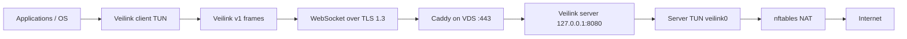

# Veilink

Veilink is a self-hosted, full-tunnel IPv4 VPN for a Linux VDS and Linux or
Windows clients. It carries a small, versioned packet protocol inside binary
WebSocket messages and relies on standard HTTPS/TLS 1.3 for authentication,
confidentiality, integrity, and transport compatibility.

> **No protocol is unblockable.** An operator can always block a server IP,
> throttle long-lived flows, use allowlists, or identify traffic statistically.
> Veilink is designed for transport replaceability and a low public attack
> surface, not as a promise of permanent reachability.

## Release scope

- Linux amd64/arm64 VDS server.
- Linux amd64/arm64 and Windows amd64 clients.
- Full IPv4 routing through a TUN interface.
- IPv6 fail-closed routing by default; IPv6 tunnelling is planned for v2.
- Per-client 256-bit bearer tokens; only SHA-256 token digests are stored on
  the server.
- Client source-address anti-spoofing, server destination validation, bounded
  queues, reconnect, health endpoints, and Prometheus metrics.
- Caddy TLS termination, systemd hardening, nftables NAT/client isolation, and
  release archives with checksums and a CycloneDX SBOM.

There is no GUI in v1. The `veilink` CLI is both the service application and
the administrative tool. On Windows it must run from an elevated terminal or
service account and be shipped beside the official signed `wintun.dll`.

## Architecture



The application never implements cryptographic primitives. Caddy and the Go
TLS stack provide TLS 1.3. See [docs/ARCHITECTURE.md](docs/ARCHITECTURE.md),
[docs/PROTOCOL.md](docs/PROTOCOL.md), and
[docs/THREAT_MODEL.md](docs/THREAT_MODEL.md).

## Quick start

Prerequisites on the VDS: a recent Debian/Ubuntu system, a domain whose A record
points at the VDS, Caddy, nftables, and root access. Ports 80/tcp and 443/tcp
must be reachable for ACME and HTTPS.

1. Build a release on a trusted machine:

   ```bash
   ./scripts/build-release.sh v0.1.0
   ```

2. Generate a client secret. The raw token is shown once:

   ```bash
   ./dist/veilink-linux-amd64 token
   ```

3. Copy `configs/server.example.yaml` to `/etc/veilink/server.yaml`. Put the
   `token_sha256` value in its client entry. Copy `configs/client.example.yaml`
   to the client and put the raw `token` there. Set both files to mode `0600`.

4. Install the Linux server using the files in `deploy/`; follow
   [docs/OPERATIONS.md](docs/OPERATIONS.md) rather than blindly running commands.
   Replace `vpn.example.com` in the Caddy environment file.

5. Validate before starting:

   ```bash
   veilink validate --type server --config /etc/veilink/server.yaml
   veilink validate --type client --config /etc/veilink/client.yaml
   ```

6. Start the server and inspect evidence:

   ```bash
   systemctl enable --now nftables caddy veilink
   systemctl status veilink caddy --no-pager
   curl -fsS http://127.0.0.1:8080/readyz -o /dev/null
   curl -fsS http://127.0.0.1:9090/metrics
   ```

The complete deployment, firewall, DNS, rollback, backup, upgrade, and incident
procedures are in [docs/OPERATIONS.md](docs/OPERATIONS.md).

## Development checks

```bash
go test -count=1 ./...
go test -race -count=1 ./...
go vet ./...
go run honnef.co/go/tools/cmd/staticcheck@v0.7.0 ./...
go run github.com/securego/gosec/v2/cmd/gosec@v2.28.0 -quiet ./...
go run golang.org/x/vuln/cmd/govulncheck@v1.7.0 ./...
GOOS=linux GOARCH=amd64 CGO_ENABLED=0 go build -trimpath ./cmd/veilink
GOOS=windows GOARCH=amd64 CGO_ENABLED=0 go build -trimpath ./cmd/veilink
```

Linux integration tests marked `integration` require root and `/dev/net/tun`:

```bash
sudo --preserve-env=PATH go test -tags=integration -count=1 ./internal/device ./internal/platform
```

## Non-goals and known constraints

- No claim of being impossible to block.
- No UDP/QUIC transport in v1; HTTPS/WebSocket is the only transport.
- No IPv6 tunnel in v1. `block_ipv6: true` prevents a silent IPv6 bypass.
- No traffic padding or browser TLS fingerprint impersonation.
- No central control plane, telemetry service, or automatic key distribution.
- A VDS provider and the destination still observe connection metadata.

## Security

Read [SECURITY.md](SECURITY.md) before exposing a deployment. Do not reuse
tokens, do not put raw client tokens in the server configuration, and never
publish `/metrics` or the loopback application listener directly.

Veilink is software, not legal advice. Operators and users are responsible for
complying with applicable law and provider terms.
